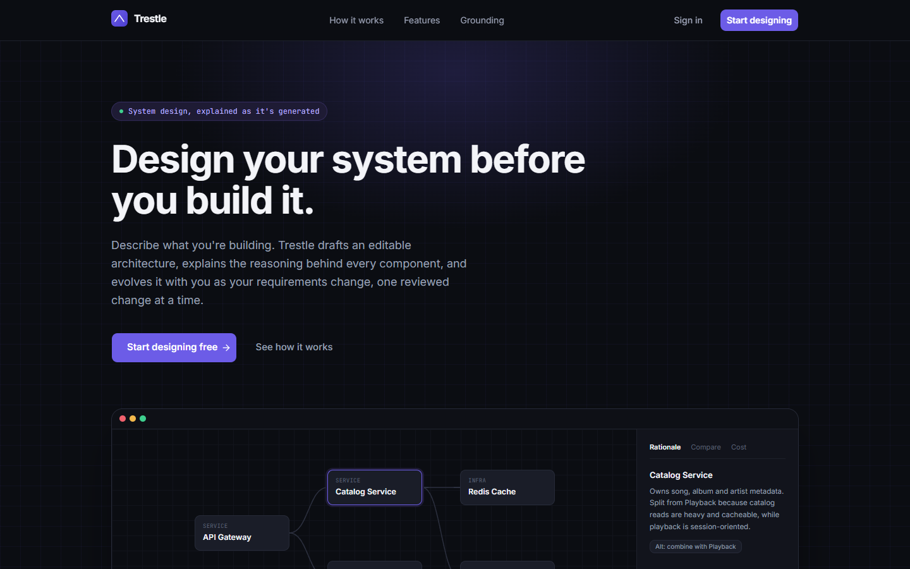
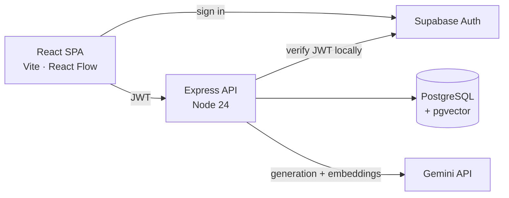

# Trestle

**An AI system design generator that has to show its working.**

Describe a product — scale, features, budget, priorities — and Trestle produces
an editable architecture diagram where every component carries a rationale
traced to a source, a comparison to how a real company solved the same problem,
and a traffic and cost estimate. Ask for a change in plain English and it
proposes a diff you accept or reject piece by piece; nothing is ever applied on
its own.

**Live demo: <https://trestle-web.onrender.com>**

[](https://github.com/Abhivic000/Trestle/actions/workflows/ci.yml)

> Hosted on free tiers. The API sleeps after 15 minutes idle, so the first
> request can take about a minute to wake it.



---

## The problem this is built around

An LLM will happily produce an architecture diagram. The hard part is making one
you could defend in a design review: every box justified, every claim about how
Netflix or Discord does it actually true, and every number something you can
recompute rather than take on faith.

Trestle is built around three constraints that follow from that.

### 1. Nothing the AI proposes is applied automatically

A change request returns a **proposal** — a list of discrete operations, each
with its own id and explanation — which is stored and rendered as a preview
overlay on the canvas. Additions and modifications are drawn dashed; removals
stay visible, marked. You tick the parts you want and only those are merged.

The guarantee is enforced on the server, not in the UI. Proposals live in their
own table with a `pending` / `accepted` / `rejected` status, and only the accept
endpoint can merge them. A proposal also records the version it was made
against: if the design has moved on since, accepting returns `409 stale_proposal`
rather than merging into a design you never saw. Partially accepting is safe —
operations that no longer make sense (a connection whose component you rejected)
are skipped and reported, and the merged result is re-validated before it is
saved.

### 2. Claims are grounded in a curated library, not generated

Rationale and industry comparisons come from a hand-written reference library of
40 entries — 24 architecture patterns and 16 case studies of named systems —
each summarised in our own words from a public engineering write-up with a
checked source URL. Entries are embedded with Gemini and stored in Postgres with
pgvector; retrieval feeds the generation prompt, and the server drops any
citation the model invents.

A model asked to describe how a real company works will confidently make up
details, so the Compare tab never generates prose — it retrieves an entry or
says it has no close match.

Retrieval is deliberately hybrid. Pure vector search is not enough here: with
real embeddings an unrelated component and entry still score around 0.6, so a
nearest-neighbour search cheerfully offered Dropbox's block storage as the
comparison for a generic application service. Candidates are first narrowed to
topics that make sense for the component's role, then ranked by similarity
within that set.

### 3. Numbers are computed, not predicted

Traffic and cost are ordinary arithmetic in a pure, unit-tested module —
no model call, nothing stored. Daily users become requests per second, a request
is followed through the system (a CDN absorbs some reads, a cache answers most
of the rest, only misses and writes reach the database), and each component gets
a provider-neutral monthly cost band. The assumptions are shown on screen beside
the figures.

It also names the component that limits growth, which is **not** the busiest
one. In a read-heavy design the cache takes 90% of reads while using a fraction
of its capacity — that is the point of having it. Each kind of component has a
soft ceiling, and the bottleneck is whichever uses the largest share of its own
ceiling at ten times today's traffic.

---

## Architecture



**Request flow for a generated design:** requirements are validated with a
shared Zod schema → heuristic queries retrieve library entries by vector
similarity → the prompt is assembled with those entries and a computed traffic
estimate → the model returns structured JSON, validated with Zod and retried
once on failure → invented citations are dropped and the server computes node
positions (models are poor at coordinates) → the design is saved as version 1.

**Auth.** Supabase issues asymmetric (ECC) JWTs, so the API verifies them
locally rather than calling out on every request. Row Level Security is enabled
on every table with **no policies**, so the browser's publishable key cannot
read or write any table directly; all access goes through the API, which scopes
every query to the authenticated user.

**Data model.** A design is structured JSON — components, connections, a data
model, and layout positions — stored once per version. Versions are immutable
and never updated in place, which is what makes diffing, history and restore
possible. Restoring writes the old design as a _new_ version rather than
rewinding.

| Table              | Holds                                                     |
| ------------------ | --------------------------------------------------------- |
| `projects`         | One design project, its requirements, its current version |
| `design_versions`  | Immutable snapshots of the design JSON                    |
| `corpus_entries`   | Reference library + 768-dim embeddings (HNSW, cosine)     |
| `change_proposals` | Pending/accepted/rejected AI proposals                    |
| `ai_requests`      | Per-user AI usage, for the daily rate limit               |

## Stack

| Layer    | Choice                                                                   |
| -------- | ------------------------------------------------------------------------ |
| Frontend | React 19, Vite, React Router, TanStack Query, React Flow, Tailwind CSS   |
| Backend  | Node 24, Express 5, Drizzle ORM, Zod, pino                               |
| Data     | Supabase Postgres + pgvector, Supabase Auth                              |
| AI       | Google Gemini (generation + embeddings), behind a provider interface     |
| Tooling  | TypeScript, pnpm workspaces, ESLint, Prettier, Husky, Vitest, Playwright |

The AI provider sits behind an interface with a deterministic fake
implementation, so the whole application can be tested without network calls,
quota or flakiness.

## Testing

152 unit and integration tests plus 14 browser tests, all run in CI on every
push.

| Layer       | Tool                             | Where                       | Needs `.env.test` |
| ----------- | -------------------------------- | --------------------------- | ----------------- |
| Unit        | Vitest (+ Supertest)             | `**/*.test.ts`              | No                |
| Component   | Vitest + Testing Library (jsdom) | `apps/web/**/*.test.tsx`    | No                |
| Integration | Vitest + Supertest, real DB/auth | `apps/api/**/*.int.test.ts` | Yes               |
| Browser     | Playwright                       | `e2e/*.spec.ts`             | Yes               |

Integration and browser tests run against a **separate** Supabase project, never
the development one, and the runners refuse to start if the two configurations
point at the same project. Browser tests are forced to use the fake AI provider,
so they are deterministic and free.

---

## Running it locally

### Prerequisites

- Node.js 24 (see `.nvmrc`)
- pnpm 10 (`npm install -g pnpm@10`)
- A Supabase project with the `vector` extension enabled
- A Google Gemini API key (free tier)

### Setup

```sh
pnpm install
cp apps/api/.env.example apps/api/.env
cp apps/web/.env.example apps/web/.env
```

- `apps/api/.env`: database connection string (Supabase session pooler),
  Supabase URL + **secret** key, Gemini key. Server only.
- `apps/web/.env`: Supabase URL + **publishable** key, API URL. Public.

Both apps validate their configuration on startup and report exactly what is
missing. Apply the migrations, then load the reference library:

```sh
pnpm --filter @trestle/api db:migrate
pnpm --filter @trestle/api corpus:ingest
pnpm dev
```

Web on <http://localhost:5173>, API on <http://localhost:4000>.

### Scripts

| Command          | What it does                            |
| ---------------- | --------------------------------------- |
| `pnpm dev`       | Run web and API with live reload        |
| `pnpm build`     | Production build of every package       |
| `pnpm typecheck` | TypeScript type check of every package  |
| `pnpm lint`      | ESLint (`pnpm lint:fix` to auto-fix)    |
| `pnpm format`    | Format all files with Prettier          |
| `pnpm test`      | All Vitest tests (unit + integration)   |
| `pnpm test:unit` | Unit and component tests only (offline) |
| `pnpm test:e2e`  | Playwright browser tests                |

### Changing the database schema

1. Edit `apps/api/src/db/schema.ts`.
2. `pnpm --filter @trestle/api db:generate` writes a SQL migration to
   `apps/api/drizzle/`. Review it.
3. `pnpm --filter @trestle/api db:migrate` applies it.
4. Commit the schema change and the migration together.

### Test environment

1. Create a second Supabase project for tests, with email confirmation off.
2. Copy `apps/api/.env.test.example` → `apps/api/.env.test` and the same for
   `apps/web`, then fill them in.
3. `pnpm --filter @trestle/api db:migrate:test`

## Deployment

Both services are described as code in `render.yaml` and deploy to Render's free
tier. See [DEPLOYMENT.md](DEPLOYMENT.md) for the steps, the environment
variables, and the failure modes worth knowing about.

## Conventions

Commits follow [Conventional Commits](https://www.conventionalcommits.org).
A Husky hook lints and formats staged files and checks the message on every
commit.
